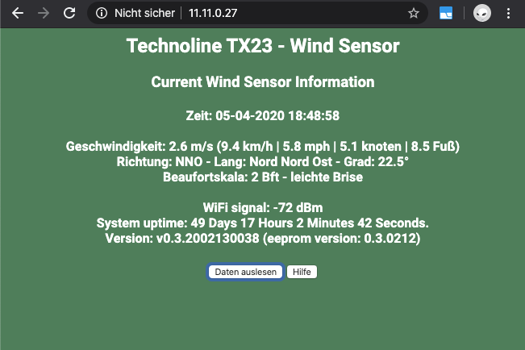
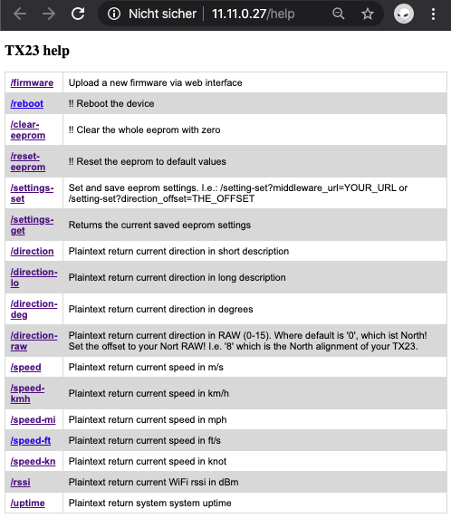
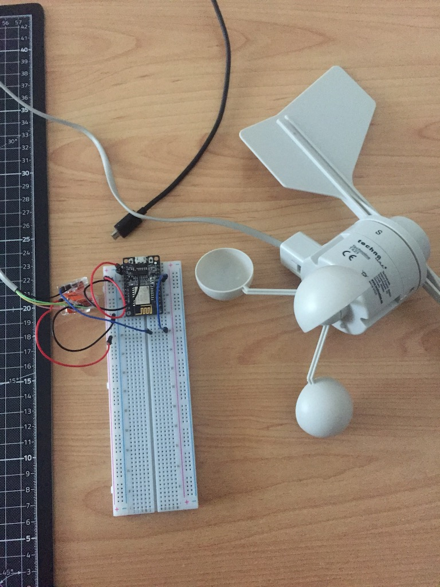
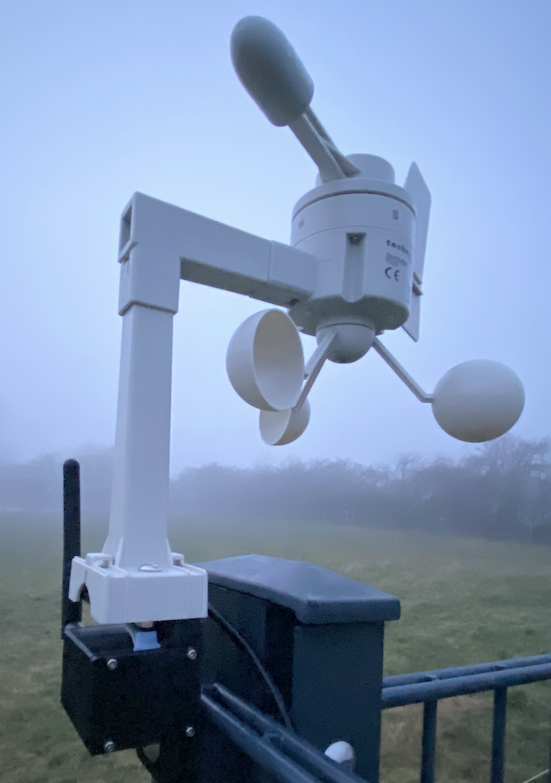

# Technoline TX23 Wind Sensor for ESP WiFi





[Technoline TX23] also known as [LaCrosse TX23], is  a wind speed and wind direction sensor. Maximum value for wind speed ist 51.1 meter per second ( 183.96 km/h or 114.31 miles per hour).

It uses 3 wires for communication and power:

| TX23 Cable/Pin   | Color           | Description |
|------            | --------------- | -----------
|Pin1              | Brown or Black  | DATA
|Pin2              | Red or Pink     | Vcc
|Pin3              | Green           | N/C
|Pin4              | Yellow          | GND


Currently it is unclear of what Voltage the TX23 is normally driven with when connected to its original Weather Station, but it seems to run with 3.3 Volts without any problems. I connected the DATA pin directly to one of ESP IO ports.

This port and the TX23 [lib] is based on the Creation of Krzysztof Egzmont which is based on the fantastic work of [John]: Big thanks.

#### Features:
- WiFi client
- WebServer (Port: 80)
- WebSocket Communication (Port: 81)
- Example web page, which will request and all Sensor informations via web socket
- Separate Job Schedules (loop's) are used. E.g.: read sensor values,  WebServer, WebSocket communication, etc.
- MQTT Support. Set Server/Port/User/PW etc. in Settings.h
- Middleware support - define a http url where speed value will be send
- Capability to set a offset for direction and speed
- OTA firmware update with user authentication. http://url:80/firmware

### Installation and configuration
Just clone this repo and open it with Atom (PlatformIO) and Build it. Current i added esp01_1m (esp8622 generic) and esp8285 support. Default is esp8285. To change it, just open the platformio.ini an uncomment your device.

The Wifi is in Client mode. So you need to define/set your ap ssid and password and also other default settings are defined in settings.h. Just check it. I.e.:
```sh
// Define your WiFi SSID and PSK
//
#define STASSID            "YOUR-WiFi-SSID"
#define STAPSK             "WiFiPassword"

// Set IO-Port for TX23 Data IO
//
static const uint16_t tx_io_port = 0;

//...
```

Mount: I also designed a case which is for the ESP, Step down powersupply (HLP-PM03) and connection for the wifi antenna and to mount the TX23. The stl can be found in docs folder. 




[John]: <https://www.john.geek.nz/2012/08/la-crosse-tx23u-anemometer-communication-protocol/>
[lib]: <https://github.com/egzumer/Arduino-LaCrosse-TX23-Library>
[LaCrosse TX23]: https://www.lacrossetechnology.com/tx23-wind-sensor
[Technoline TX23]: https://www.lacrossetechnology.com/tx23-wind-sensor
